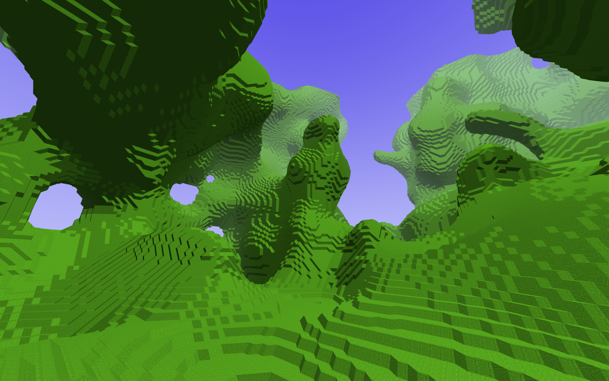
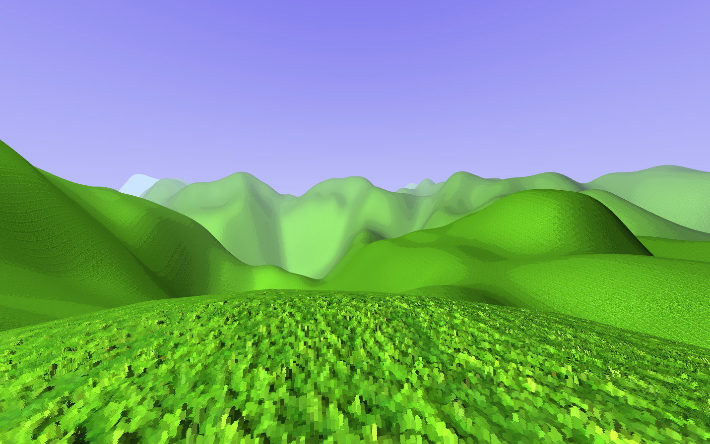
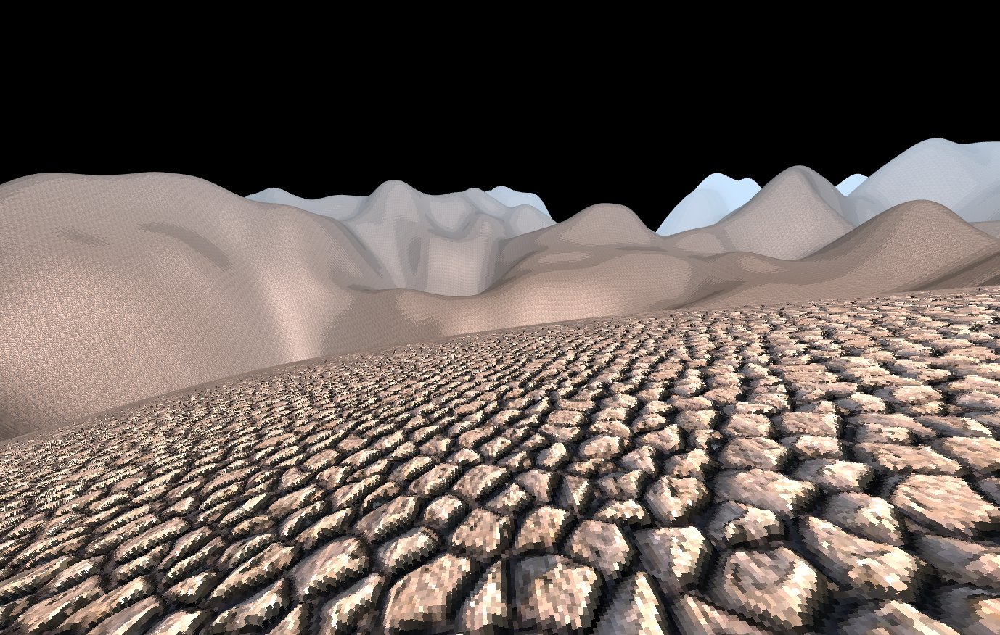

--Untitled Game Engine--

Ubuntu setup:
1. Install glfw3 
   - sudo apt-get install libglfw3
   - sudo apt-get install libglfw3-dev
2. Install glew
   - sudo apt-get install libglew-dev
3. You might not have these things already. Install them
   - sudo apt-get install cmake build-essential libgl1-mesa-dev

Making an OpenGL game engine in c++ that will feature extensive abstraction from the OpenGL API and many procedural features.

Features:
- Full buffer abstraction
   - Dynamic Index and Vertex buffer allocation by growing/shrinking CPU side buffer and re-using empty fragments. 
- Simple lighting
- Somewhat easy texture abstraction
- Simple perlin noise hills with almost dynamic chunk generation
- Dynamic chunk generation
  - Using marching cubes to create a smoother mesh than voxels
- normal maps and voxel-izing them
  - This kind of works, but the layers from the parallax are still visible, ill fix this later

Current features I am working on from most important to least:
 - Increasing efficiency of code by using multi-threading for CPU side buffer building code
 - Implementing procedural tree generation using space colonization algorithm.

Things I want to do and make sense but am kicking down the road:
 - Actual game loop
 - Actual game things like collision
 - Any kind of gameplay at all

## Marching cubes!!!!:

## Some hills with lighting:

## Parallax rock hills:

## First attempt at voxel parallaxing:

